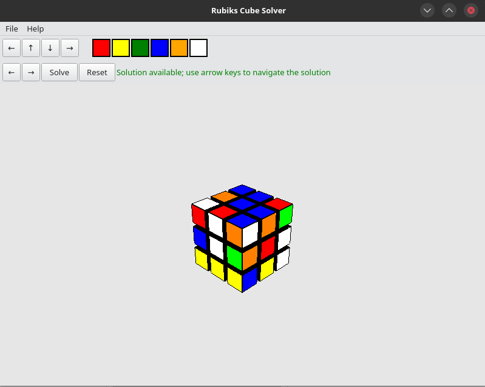

# Interactive Rubik's Cube Simulator

A Python-based interactive Rubik's Cube simulator built with PyQt5 and OpenGL. This application provides a 3D visualization of a Rubik's cube that users can manipulate, color, and solve.



This project was created as a demonstration of 3D graphics programming with Python and OpenGL, combining interactive graphics with a classic puzzle game.

## Features

- Full 3D visualization of a Rubik's cube
- Interactive rotation controls using keyboard and mouse
- Face coloring functionality
- Support for multiple rotation types:
  - Row rotations (top and bottom)
  - Column rotations (left and right)
  - Face rotations (front and back)
- Animation system for smooth rotations
- Solution steps execution system

## Requirements

- Python 3.x
- PyQt5
- PyOpenGL

## Installation

1. Clone this repository:
```bash
git clone https://github.com/jasonbrianhall/rubikscube.git
cd rubikscube
```

2. Install required packages:
```bash
pip install -r requirements.txt
```

## Usage

Run the application using:
```bash
python main.py
```

When launched, the application opens a window displaying a 3D Rubik's cube with the following interface elements:

- A row of colored buttons at the top (Red, Yellow, Green, Blue, Orange, White) for selecting colors
- Navigation arrows for rotating the cube view
- A solution control panel with Previous/Next step buttons and a status indicator
  - "Solution available" appears in green when a valid solution is found
  - "No solution available" appears in red when the cube cannot be solved.  It will also sometimes display this if it's already solved.
  - It will display a message about tables.json being created if it doesn't exist.

### Controls

#### Keyboard Controls:

- **Cube Rotation:**
  - Arrow Left/Right: Rotate entire cube horizontally
  - Arrow Up/Down: Rotate entire cube vertically

- **Row Rotations:**
  - A: Rotate top row counterclockwise
  - D: Rotate top row clockwise
  - H: Rotate bottom row counterclockwise
  - F: Rotate bottom row clockwise

- **Column Rotations:**
  - W: Rotate front column up
  - S: Rotate front column down
  - T: Rotate back column up
  - G: Rotate back column down

- **Face Rotations:**
  - I: Rotate face up
  - K: Rotate face down
  - J: Rotate reverse face up
  - L: Rotate reverse face down


#### Mouse Controls:

- Click on any face to apply the currently selected color
- Click on white space and drag to rotate the cube
- Use wheel mouse to zoom in and out

## Project Structure

- `main.py`: Application entry point
- `main_window.py`: Main window UI implementation
- `gl_widget.py`: OpenGL widget for 3D rendering
- `cube_model.py`: Rubik's cube model and logic
- `colors.py`: Color definitions and enums
- `rubiksolver.py`: Function to bridge the json representing the cube to a Kociemba string text representation.
- `twophase`:  Directory containing the logic to actually solve the cube
- `appicon.py`: Base64 encoded Icon used to make the game prettier in MS Windows instead of the generic icon

## Technical Details

### Solve Logic

The software converts a dictionary created by the OpenGL software into a python dictionary and that in turn gets converted to kociemba string which then is ran through a search pattern to solve the puzzle. When the program first runs, it will create a .rubikscube/tables.json in the users home directory (this creation usually takes about a minute) which then speeds up any future solve time.  Without this feature, solve times would average a minute or more each time.  If tables.json gets corrupted, it will have to be manually deleted and recreated.

### Cube Model

The cube is modeled as 27 individual cubelets (3x3x3), each with up to six faces. The state of each cubelet is tracked using:
- Position coordinates (x, y, z)
- Face colors
- Face visibility (exterior vs interior)

### Rotation System

The application supports three types of rotations:
1. Row rotations (horizontal layers)
2. Column rotations (vertical layers)
3. Face rotations (front/back faces)

Each rotation is animated smoothly using a timer-based animation system.

### Color System

Colors are implemented using an Enum class that defines:
- Standard cube colors (Red, Yellow, Green, Blue, Orange, White)
- Special states (Unassigned, Interior)

### Rendering

The cube is rendered using OpenGL with:
- Perspective projection
- Depth testing
- Face culling
- Smooth animations
- Click detection for face coloring

## Contributing

Contributions are welcome! Please feel free to submit a Pull Request.

## License

MIT License

Copyright (c) 2025 Jason Hall (jasonbrianhall@gmail.com)

Permission is hereby granted, free of charge, to any person obtaining a copy
of this software and associated documentation files (the "Software"), to deal
in the Software without restriction, including without limitation the rights
to use, copy, modify, merge, publish, distribute, sublicense, and/or sell
copies of the Software, and to permit persons to whom the Software is
furnished to do so, subject to the following conditions:

The above copyright notice and this permission notice shall be included in all
copies or substantial portions of the Software.

THE SOFTWARE IS PROVIDED "AS IS", WITHOUT WARRANTY OF ANY KIND, EXPRESS OR
IMPLIED, INCLUDING BUT NOT LIMITED TO THE WARRANTIES OF MERCHANTABILITY,
FITNESS FOR A PARTICULAR PURPOSE AND NONINFRINGEMENT. IN NO EVENT SHALL THE
AUTHORS OR COPYRIGHT HOLDERS BE LIABLE FOR ANY CLAIM, DAMAGES OR OTHER
LIABILITY, WHETHER IN AN ACTION OF CONTRACT, TORT OR OTHERWISE, ARISING FROM,
OUT OF OR IN CONNECTION WITH THE SOFTWARE OR THE USE OR OTHER DEALINGS IN THE
SOFTWARE.

## Acknowledgments

- Rubik's cube solving algorithm adapted from [cube-solver](https://github.com/tcbegley/cube-solver) by Tom Begley (Copyright (c) 2020 Tom Begley)

